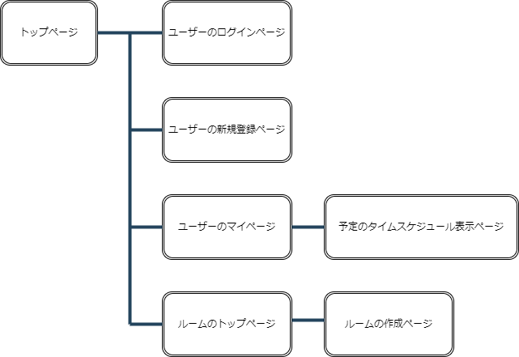

# アプリケーション名
schedule_share

# アプリケーション概要
ユーザー同士で予定をシェアすることで、一緒に旅行や遊びに行く計画を立てる際の助けとなるアプリ。

# URL
https://schedule-share.onrender.com

# テスト用アカウント
・Basic認証ID：admin

・Basic認証パスワード：1234

・メールアドレス：test@gmail.com

・パスワード：123test

# 利用方法

## 予定をカレンダーに追加
1.トップページから新規登録を行う

2.自分のマイページへ移動

3.カレンダーが表示され、その下に予定の情報（日付の入力に注意）を入力し、「追加する」ボタンを押す

4.カレンダーに予定が追加され、その予定のタイトルからタイムスケジュールに移動可能

# アプリケーションを作成した背景
家族や友人と旅行の計画を立てたり飲みにいったりする際に、複数人の場合予定を合わせるのが難しく、会いたいと感じても実現できず疎遠になりやすいと感じていた。そこで、予定をお互いにシェアし合うことで、問題の解決の助けになるのではと思い、予定をシェアするアプリを開発しようと考えました。

# 洗い出した要件
・ユーザーの新規登録とログイン
・ユーザーのマイページ
・カレンダーの表示と予定の追加
・予定のタイムスケジュールの表示
・ルームの作成
・同じルーム内での予定の共有機能

# 実装した機能についての画像およびGIF
・ユーザーの新規登録とログイン
  https://i.gyazo.com/754e516027ce6420e833292a68dec7c6.png
  https://i.gyazo.com/aa88bd4ded70f57e578ef77a4a4301ab.png

・ユーザーのマイページ
  https://i.gyazo.com/a5587fb95b13a8132d826b2adf6f8140.png

・マイページ内でカレンダーの表示と予定の追加
  https://i.gyazo.com/0bd866b170ca7d10d25c0f3b73d335af.png
  https://i.gyazo.com/51ba7c5b75fd25c1cee454e6c419090d.png

・予定のタイムスケジュールの表示
  https://i.gyazo.com/843b022476712ff890767824f7d26ac4.png

・実際の予定の追加動画（GIF）
  https://i.gyazo.com/004adbad6216e44eeaed54d628c22161.gif

# 実装予定の機能
・ルームの作成とルーム内での予定の共有

# データベース設計

## users テーブル

| Column             | Type       | Options                        |
| ------------------ | ---------- | ------------------------------ |
| email              | string     | null: false, unique: true      |
| encrypted_password | string     | null: false                    |
| name               | string     | null: false                    |

### Association

- has_many :schedules
- has_many :room_users
- has_many :rooms, through: :room_users

## schedules テーブル

| Column           | Type       | Options                        |
| ---------------- | ---------- | ------------------------------ |
| number           | string     | null: false                    |
| title            | string     | null: false                    |
| start_id         | integer    | null: false                    |
| end_id           | integer    | null: false                    |
| user             | references | null: false, foreign_key: true |

### Association

- belongs_to :user

## rooms テーブル

| Column            | Type       | Options                        |
| ----------------- | ---------- | ------------------------------ |
| name              | string     | null: false                    |

### Association

- has_many :room_users
- has_many :users, through: :room_users

## room_users テーブル

| Column            | Type       | Options                        |
| ----------------- | ---------- | ------------------------------ |
| user              | references | null: false, foreign_key: true |
| room              | references | null: false, foreign_key: true |

### Association

- belongs_to :room
- belongs_to :user

# 画面遷移図

# 開発環境

# ローカルでの動作確認方法

# 工夫したポイント

